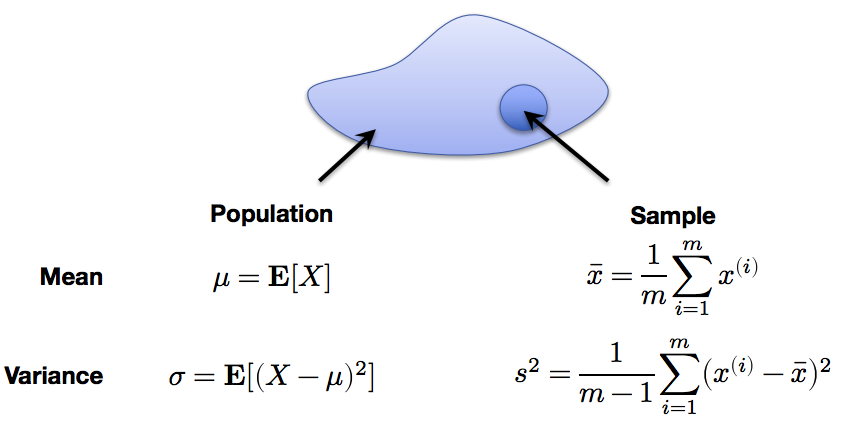
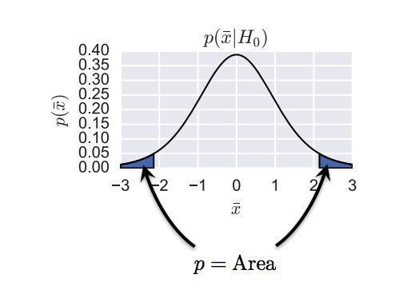

# Hypothesis testing
##  sample statistics and central limit theorem
When we have a dataset, we could sample data from this set. And we could use sample result to estimate statistics for total set.
For example, in total we have 10000 data points, but we could not get them all. Therefore, we sampled 100 data points to guess the original dataset expectation and variance. 

We also could know the sample mean's expectation and variance.
$E(\bar x) = E(\frac{1}{m}\sum x^{i})=\frac{1}{m}E(\sum x^{i})=\mu$

$Var[\bar x]=Var(\frac{1}{m}\sum x^{i})=\frac{1}{m^2}Var(X)=\frac{\sigma^2}{m}$

Central limit theorem discovered **whatever** the distribution is for the $X$, we could find the $\bar x$ for samples having a **Gaussian distribution**. 

$$\bar x -> \mathcal{N} (\mu,\frac{\sigma^2}{m})$$

By the way, for m<30, and we could use Student's t-distribution with m-1 degrees of freedom.

$$\frac{\bar x - \mu}{s/m^{1/2}} -> T_{m-1}$$

## Basic hypothesis testing

In the beginning, we should have two hypothesis, one is null hypothesis $H_0$ and an alternative hypothesis $H_1$. Given some data x, we want to accept or **reject** the null hypothesis in
favor of the alternative hypothesis.

| $H_0$ true   | $H_1$ true   |
| ------------ | ------------ | ------------- |
| Accept $H_0$ | Correct      | Type II error |
| Reject $H_0$ | Type I error | Correct       |

$p(reject H_0|H_0 true)$ is "significance of test"

$p(reject H_0|H_1 true)$ is "power of test"

The basic approach is to calculate the probability of observing data under null hypothesis.

$$P = p(data|H_0 true)$$

It is not $p(H_0 true|data)$, therefore p value should not so important. 

Confidence intervals. We can use t statistic to create confidence intervals for the mean. Because $\bar x$ has mean $\mu$ and variance $s^2/m$, we know that $1-\alpha$ of its probability mass must lie within the range.
$$\bar x = \mu \pm \frac{s}{\sqrt m} F^{-1}(1-\alpha/2)$$

### Example
Given a sample, $x_1,x_2,...x_m$, 

$H_0:\mu=0$,$H_1:\mu!=0$. 

Using central limit theorem, we know $$\frac{\bar x - \mu}{s/m^{1/2}} -> T_{m-1}$$. Here, $\mu=0$, therefore, we could use a $t=\frac{\bar x}{s/m^{1/2}}$ and compute $p=p(x>|t|)+p(x<-|t|)=2F(-|t|)$

## Experiment

A/B testing, we could get result from two settings: control group($\mu_1$) and treatment group($\mu_2$)
$$H_0: \mu_1=\mu_2$$
$$H_1: \mu_1!=\mu_2$$
 So, t is $\frac{\bar x_1 - \bar x_2}{(s_1^2/m_1+s_2^2/m_2)^{1/2}}$