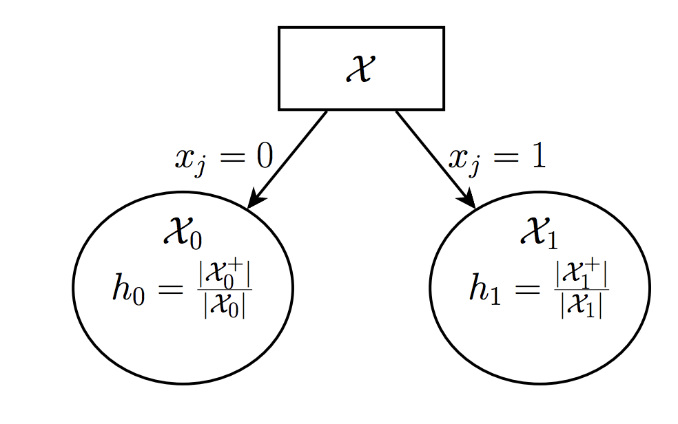
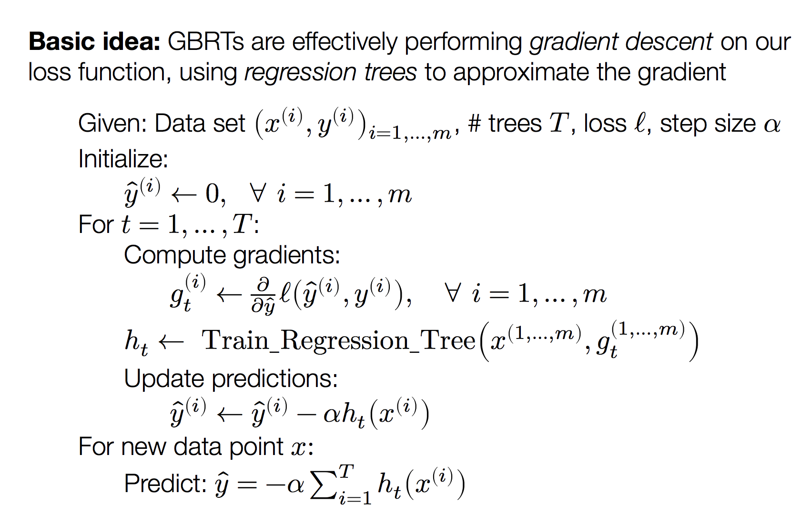

# what is desicion tree

Decision tree is tree-based algorithm and it has two type: regression tree and classification tree. 

The main idea for decision tree is to choose one place to cut the whole sample space at one time to get two branches and cut recurisively. In ID3 algorithm, we only consider one demension to cut the space. **You can think of the hypothesis function of decision trees as partitioning the input space with axis-aligned boundaries**. In each partition, predict a constant value.

The pesudo code for desicion tree is like this

```
id3(datasets, target, attributes):
    '''
    datasets is training data
    target is what we want to use to cut the tree
    attributes is all possible labels
    '''
    node = treenode(datasets)
    dictionary = summarize(datasets,targetAttributes)# datasets predict target
    for k in dictionary:
        if dictionary[k]=len(datasets):
            node.label = k
            return node
    if attributes is None or len(datasets) < min allowed per branch:
        node.label = most common label
        return node
    bestA = the attribute with most information gain
    node.decision = bestA
    for v in bestA:
        subset = the subset of datasets that have v in bestA
        if subset is not None:
            node.addBranch(id3(subset,target,attributes-bestA))
        return node
```
## what is hypothesis function 
$h_\theta(x)$ is a decision tree ($\theta$ is shorthand for all the parameters that define the tree: tree structure, values to split on, leaf predictions, etc)
## What is the loss function
Let’s assume the output is binary for now (classification task, we will deal with regression shortly), and assume $y \in \{0,1\}$.

The typical decision tree algorithm using a probabilistic loss function that considers $y$ to be a Bernoulli random variable with probability.
$$p(y|h_\theta(x))=h_\theta(x)^y(1-h_\theta(x))^{1-y}$$

$$\ell(h_\theta(x),y) = - log(p(y|h_\theta(x))) = -y log h_\theta(x)-(1-y)log(1-h_\theta(x))$$

## how to minimize loss function
We will use greedy method to incrementally build the
tree (i.e., minimize the loss function) one node at a time.

Consider a single leaf in a decision tree (could be root of initial tree)

Let $\mathcal{X}$ denote the examples at this leaf (e.g., in this partition), where $\mathcal{X^+}$ denotes the positive examples and $\mathcal{X^-}$ denotes negative (zero) examples. It is known by us now. 

What should we choose as the (constant) prediction $h$ at this leaf?

$$minimize_h \sum \ell(h,y) = -\frac{\mathcal{X^+}}{\mathcal{X}}log h--\frac{\mathcal{X^-}}{\mathcal{X}}log (1-h)$$ Here we could know that $h = \frac{\mathcal{X^+}}{\mathcal{X}}$. Which achieves loss: $\ell = -hlogh-(1-h)log(1-h)$.

Suppose we will split this left to two part $\mathcal{X_0}$ and $\mathcal{X_1}$ and we will get two prediction $h_0=\frac{\mathcal{X_0^+}}{\mathcal{X_0}}$ and $h_1=\frac{\mathcal{X_1^+}}{\mathcal{X_1}}$. 



The new leafs will each now suffer loss $$\ell_0 = -h_0logh_0-(1-h_0)log(1-h_0)$$
$$\ell_1 = -h_1logh_1-(1-h_1)log(1-h_1)$$

Thus, if we split the original leaf on feature $\ell$, we no longer suffer our original loss $\ell$, but we do suffer losses $\ell_1$ + $\ell_2$, i.e., we have decreased the overall loss function by $\ell-\ell_0-\ell_1$ (this quantity is called
information gain)

Greedy decision tree learning – repeat:

- For all leaf nodes, evaluate information gain (i.e., decrease in loss) when splitting on each feature $j$
- Split the node/feature that minimizes loss the most
- (Run cross-validation to determine when to stop, or after N nodes)


For Regression trees are the same, except that the hypothesis $h$ are realvalued instead of probabilities, and we use squared loss
$$\ell(h,y)=(h-y)^2$$
Therefore,
$h = \frac{1}{|\mathcal{X}|}y$, and and suffers loss $\ell=\frac{1}{|\mathcal{X}|}\sum (h-y)^2$
# how to choose the right attribute to split

We can use information entroy gain to see how to split the datasets. Information Gain is the expected reduction in entropy
of target variable Y for data sample S, due to sorting
on variable A. 

It is also common to use variance reduction and gini index to split datasets.

$Gain(S,A) = H_s(Y)-H_s(Y|A)$

```
Information Gain Pseudocode
infoGain(examples, attribute, entropyOfSet)
   gain = entropyOfSet
   for value in attributeValues(examples, attribute):
       sub = subset(examples, attribute, value)
       gain -=  (number in sub)/(total number of examples) * entropy(sub)
   return gain

Entropy Pseudocode

entropy(examples)
   result = 0
   # handle target attributes with arbitrary labels
   dictionary = summarizeExamples(examples, targetAttribute)
   for key in dictionary:
       proportion = dictionary[key]/total number of examples
       result -= proportion * log2(proportion)
   return result
```

# what is problem

The problem is overfitting for decision tree. It is possible for us to have so many branches and overfit the training datasets.

# how to solve it

1. pruning on the tree, Pruning of the decision tree is done by replacing a whole subtree by a leaf node.
2. K-fold validation 
3. TODO:


# why we need random forest

Because we want to use Bootstrap aggregating to handle overfitting problem.  Given a training set X = x1, ..., xn with responses Y = y1, ..., yn, bagging repeatedly (B times) selects a random sample with replacement of the training set and fits trees to these samples:

For b = 1, ..., B:
1. Sample, with replacement, n training examples from X, Y; call these Xb, Yb.
2. Train a classification or regression tree fb on Xb, Yb.

After training, predictions for unseen samples x' can be made by averaging the predictions from all the individual regression trees on x' or by taking the majority vote in the case of classification trees.

# how to implement a decision tree

# boosting

Decision trees have notable advantages (they are relatively easy to interpret, usually fast to train, insensitive to scale of input features)

But, they are also quite limited in their representation power (require axisaligned splits, don’t model probabilities very smoothly)

Basic idea of tree ensemble methods is to combine multiple tree models together to form a better predictor. Two of the most popular ensemble methods: random forests and boosting.

Boosting originated as an idea in theoretical machine learning, for “boosting” the performance of weak classifiers (i.e., combining many classifiers that each had modest accuracy to one that had high accuracy). We will introduce Gradient Boosted Regression Trees (GBRT) algorithm. 


