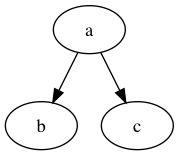
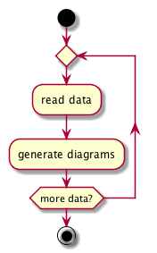

# Basic Drawing
We could use [Graphviz](http://graphviz.org/) to draw a graph in code and it is also easily to used in Markdown file. In this blog, I will focus on `dot` tool. 

In the beginning, we need to install it. If you are a Mac user, we could use `brew install graphvis`. For other user, you could download file from the official [website](https://graphviz.gitlab.io/download/).

You could create a file with the following code.
```
digraph{
a->b
a->c
}
```

And then you need to save it as `demo.gv`. Next, run the code 
```
	dot -Tpng demo.gv demo.png
```

You could get the following pic. 



In this command, you could change `-Tpng` to `-Tjpg` or `-Tpdf`, `-Tsvg`. 

To add them to markdown, we could use service from `gravizo`.

```
b,
a->c
 }
'/>
```

## edge parameters
You could change edge parameters to get different appearance.

|parameters|comment|
|----|-----|
|label| add text on the line|
|style| bold, dotted, filled; |
|dir|forward, back, both, or none|
|color|[ref](http://www.graphviz.org/doc/info/colors.html)|


## Node parameters
You could define the node in the beginning and then refer it in the following part. 

|parameters|comment|
|----|-----|
|color|[ref](http://www.graphviz.org/doc/info/colors.html)|
|fillcolor|..|
|height|.5 inch default|
|image|image filename|
|shape|[ref](http://www.graphviz.org/doc/info/shapes.html)
|width|.75 inch|
## Principal Graph Attributes
Here I just want to mention `rank`.

Using the following code we could get multiple node in the same level.

```
digraph G {
    A -> B,
    A -> C,
    C -> D,
    X -> Y,
    {rank = same; A; X;},
    {rank = same; B; D; Y;},
}
```
 B,
    A -> C,
    C -> D,
    X -> Y,
    {rank = same; A; X;},
    {rank = same; B; D; Y;},
}
'/>

# Flow chart

Actually, we could still use `dot` to generate flow chart. But it will spend lots of time to change shape to express exact idea. One good tool is [plantUML](http://plantuml.com/)

We could use `startuml` to begin the chart. The basic chart could generate use following chart. More info could find [here](http://plantuml.com/activity-diagram-beta).

```
@startuml

start

if (Graphviz installed?) then (yes)
  :process all\ndiagrams;
else (no)
  :process only
  __sequence__ and __activity__ diagrams;
endif

stop

@enduml
----
@startuml

start

repeat
  :read data;
  :generate diagrams;
repeat while (more data?)

stop

@enduml
```

We can save them in a `demo.txt` file. Then download plantUML jar [file](http://sourceforge.net/projects/plantuml/files/plantuml.jar/download) to generate png.

```
java -jar plantuml.jar demo.txt
``` 




# UML
You can also use this tool to get UML graph. There are lots of usage in the official [website](http://plantuml.com/class-diagram).

I just list some basic code here.

```
@startuml
class Foo1 {
  You can use
  several lines
  ..
  as you want
  and group
  ==
  things together.
  __
  You can have as many groups
  as you want
  --
  End of class
}

class User {
  .. Simple Getter ..
  + getName()
  + getAddress()
  .. Some setter ..
  + setName()
  __ private data __
  int age
  -- encrypted --
  String password
}
```