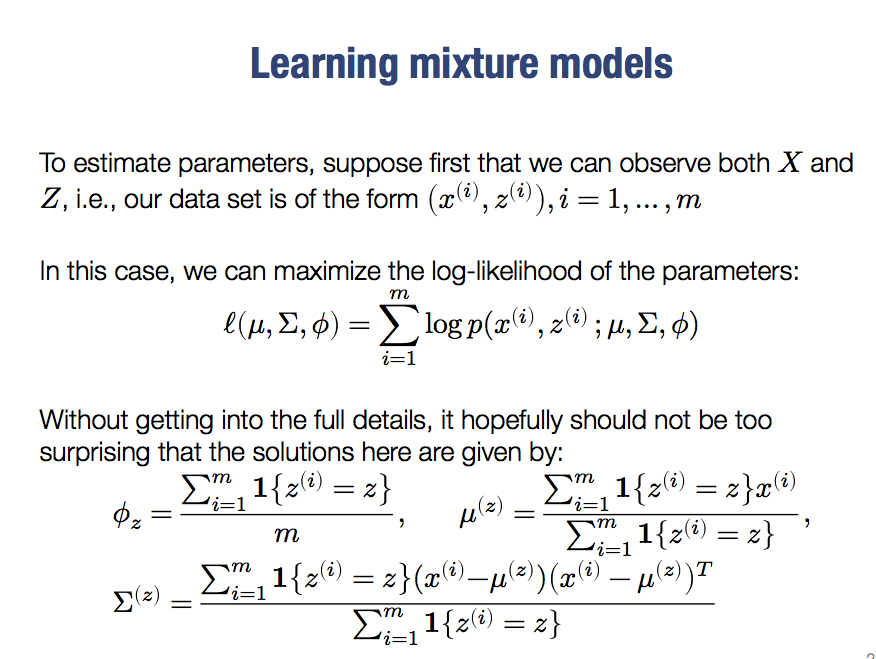

# What is Anomaly
In supervised view, we could think these points are with some labels. In unsupervised view, there are outliers, which means they have very low probability.

When we could model a dataset with a distribution, we could find which point's probability is very low, then we could think them as a outlier.

# Multivariate Gaussian distribution
$$P(x) = \frac{1}{\Sigma \sqrt {2\pi}} e^{-({x - \mu } )^2/{2\Sigma ^2 } }$$

In this distribution, we could prove $E[X] = \mu$, $Cov[X]= \Sigma$

For $x_i$ in $X$, if $p(x_i)=\mathcal{N} (x;0,1)$, then if $y=Ax+b$, we could also know $y~\mathcal{N}(AA^T)$

# Mixture of Gaussian
If there are many different Gaussian distributions in one dataset. We could use mixture of Gaussian to model it. 

In the beginning, we assume there is a variable $Z$ to represent different categories for distribution. $Z~categorical(\phi)$, here $\phi \in [0,1]^k, \sum^k_{I=1}\phi_i=1$

We model this data with $$X|Z=z ~\mathcal{N}(\mu^{(z)},\Sigma^{(z)})$$, therefore $p(x) = \sum_z p(x|Z=z)p(Z=z)$

We could use log-likelihood to do the parameter estimation.

But we need to understand, there is no $Z$ in reality. What we could do is to use EM(Expectation maximaization) algorithm, doing a process like k-means.

E step: compute $p(z^{(i)}=z;x^{(i)};\mu,\Sigma,\phi)$ using bayes
$$p(z^{(i)}=z;x^{(i)};\mu,\Sigma,\phi) = \frac{p(z^{(i)}=z;x^{(i)};\mu,\Sigma)p(z^{(i)}=z;\phi)}{\sum_{z'} p(z^{(i)}=z';x^{(i)};\mu,\Sigma)p(z^{(i)}=z';\phi)}$$
$$=\frac{\mathcal{N}(x^{(i)};\mu^{(z)},\Sigma^{(z)})\phi_z}{\sum_{z'} \mathcal{N}(x^{(i)};\mu^{(z')},\Sigma^{(z')})\phi_{z'}}$$

M step: re-estimate parameters using these probabilities

So, it still has local optimal problem. The difference between k-means and mixture of gaussian is **EM is a soft assignment**, one point could be different distribution. However, k-means is a hard assignment.