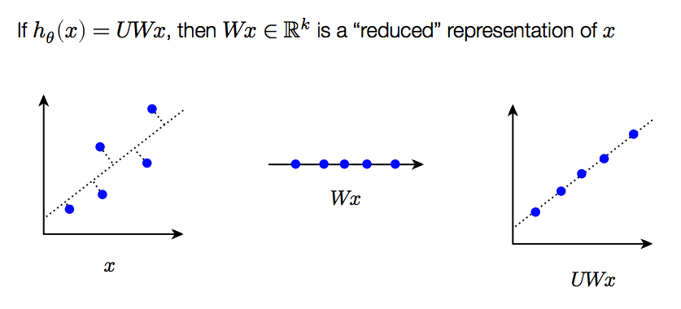

# Dimension Rerduction
## PCA
Principal component analysis (PCA) looks at “simplifying” the data in another manner, by preserving the axes of major variation in the data.
### Hypothesis function
$h_\theta (x) = UWx, \theta={U \in R^{n*k},W\in R^{k*n}}$. 
We are compressing input by multiplying by a low rank matriex.


### Loss function
$$\ell(h_\theta(x), x)=\|\mu - x\|_2^2$$

### Optimization problem.
$$minimize_{U,W} = \sum_{I=1}^m \| UWx^{(i)}-x^{(i)}\|^2_2$$

### procedure
Given: **normalized** data matrix X, k components

1. Compute singular value decomposition $USV^T = X$, where $U,V$ is orthogonal and $S$ is diagonal matrix of singular values.
2. $U = V_{:,1:k}S^{-1}_{1:k,1:k}, W = V^{T}_{:,1:k}$
3. Loss given by $\sum^n_{i=k+1}S^2_{ii}$

```python
def pca(X,k):
X0 = (X - np.mean(X, axis=0)) / np.std(X,axis=0) + 1e-8)
U,s,VT = np.linalg.svd(X0, compute_uv=True, full_matrices=False)
loss = np.sum(s[k:]**2)
return VT.T[:,:k]/s[:k], VT.T[:,:k], loss
```