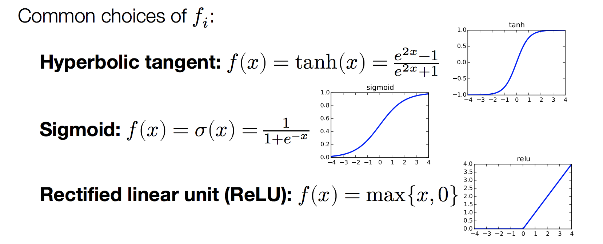

# Neural network
The key difference is it combines non-linear function with linear function. It could implement any function by using enough neural.

Before, we could learn $h_\theta(x)=\theta^T\phi(x)$, if we still set $\phi(x)$ to be a linear function, which we think it should be a two-stage function, but in the end it is still a one stage linear function.

## Hypothesis function
Neural networks are a simple extension of this idea, where we additionally apply a non-linear function after each linear transformation.

$$h_\theta(x) = f_2(W_2f_1(W_1x+b_1)+b_2)$$, here $h_1$ and $h_2$ are all non-linear function.

A neural network will a single hidden layers (and enough hidden units) is a universal function approximator, can approximate any function over inputs.

In practice, not that relevant (similar to how polynomials can fit any function), and the more important aspect is that they appear to work very well in practice for many domains

The hypothesis $h_\theta(x)$ is not a convex function of parameters \theta={W_i,b_i}, so we have possibility of local optima

Architectural choices (how many layers, how they are connected, etc), become important algorithmic design choices (i.e. hyperparameters)

“Deep learning” refers (almost always) to machine learning using neural network models with multiple hidden layers
## optimization
Key challenge for neural networks: often have very large number of samples, computing gradients can be computationally intensive.

Alternative approach, stochastic gradient descent (SGD): adjust
parameters based upon just one sample.

For i = 1..m
	$$\theta = \theta -\nabla_{\theta} \ell(h_\theta(x^{(i)}),y^{(i)})$$
	
We often do this in mini batch. And we could get $\nabla_{\theta} \ell(h_\theta(x^{(i)}),y^{(i)})$ from back propagation.
