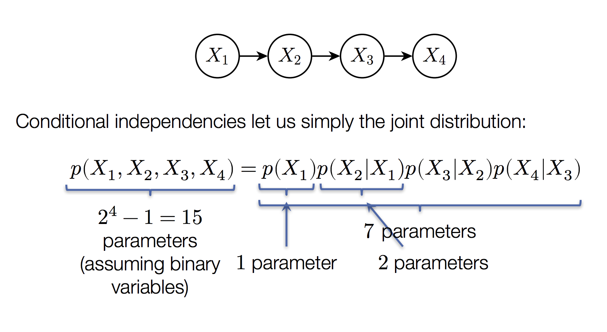
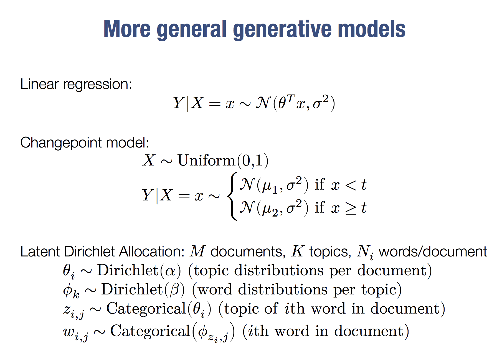

# Probability modeling
What is probability modeling? It is a high dimension distribution for p(X). It represents distribution more compactly by exploiting conditional independencies.

## Bayesian Network
The main idea is to represent $P(X)$ with $\prod P(X_i|parents(X_i))$. It is also a generative model, **which means it construct distribution as a 'sequential story'**. 

## Markov chain Monte Carlo

Markov chain Monte Carlo (MCMC) refers to a class of methods that approximately draw samples from over the hidden variables

The techniques work by iteratively sampling from some of the hidden variables (we’ll denote them $Z_i$) conditioned on others (both other hidden variables $Z_i$ and observed variables $X$)

