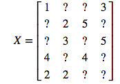

# Recommendation
## Collaborative filtering
Solely upon the preferences that other users have indicated for these items.(rating for items): row -> users  column-> items

The task of collaborative filtering, then, is to “fill in” the remaining entries of this matrix given the observed matrix. This X matrix that we observed is sparse but the unknown entries do not correspond to actual zeros in the matrix, but are rather just truly unknown.




▪	User-user approaches: In this approach we estimate a user’s rating of an item by finding “similar” users and then looking at their predictions for this item.
▪	Item-item approaches: These methods take the converse approach, and estimate a user’s rating of a item by finding similar items and then looking at the user’s rating of these similar items.
▪	Matrix factorization: Finally, the last class of approaches works a little bit differently, by aiming to construct a low-rank matrix that approximates the observed entries of the rating matrix.

## user-user approaches

To start, let's introduce a slightly more formal bit of notation to define our problem.  Let $\hat{X}_{ij}$ denote our prediction for the $i$th user and $j$th item (i.e., this will be one of the elements that is missing from the matrix $X$, which we want to predict).  A common form for the prediction make by the user-user approach would be
$$
\hat{X}_{ij} = \bar{x}_i + \frac{\sum_{k:X_{kj} \neq 0} w_{ik} (X_{kj} - \bar{x}_k)}{\sum_{k:X_{kj} \neq 0} \lvert w_{ik} \rvert}
$$
where $\bar{x}_i$ denotes the average of the observed ratings for user $i$, and $w_{ik}$ denotes a _similarity weight_ between user $i$ and user $k$ (which we will define shortly).  The intuition behind this approach is the following: if we want to predict user $i$'s rating for item $j$, we look across all users that _do_ have ratings for item $j$, and we average these together, weighted by a similarity function between the two users (we divide by $\sum_{k:X_{kj} \neq 0} \lvert w_{ik} \rvert$ so that we are taking a weighted average, noting that we take the absolute value because similarity weights can sometimes be positive or negative depending how we define then).  Because user's also frequently have their own "baseline" rating (i.e., some users naturally assign lower ratings than others), it's slightly better to do this modeling in the "difference space", the difference between a user's rating and their mean rating, and then add re-scale by adding a user's mean score.

Let's see how this works in code.  
```python
def predict_user_user(X, W, user_means, i, j):
    """ Return prediction of X_(ij). """
    return user_means[i] + (np.sum((X[:,j] - user_means) * (X[:,j] != 0) * W[i,:]) / 
                            np.sum((X[:,j] != 0) * np.abs(W[i,:])))
```

Item-item same as user-user instead of doing on columns

Weight could calculated by Pearson correlation. Let’s take the standard example of Pearson correlation (one of the most common methods for defining these weights)

$$
W_{ik} = \frac{\sum_{j \in \mathcal{I}_{ij}} (X_{ij} - \bar{x}_i)(X_{kj} - \bar{x}_k)}
{\sqrt{\sum_{j \in \mathcal{I}_{ij}}(X_{ij} - \bar{x}_i)^2} \sqrt{\sum_{j \in \mathcal{I}_{ij}}(X_{kj} - \bar{x}_k)^2}}
$$

```python
def pearson(X,user_means, i,j):
    I = (X[i,:]!=0) * (X[j,:]!=0)
    xi = X[i,I] - user_means[i]
    xj = X[j,I] - user_means[j]
    return (xi @ xj)/(np.sqrt((xi @ xi)*(xj @ xj))+1e-12)

```


## Matrix factorization

Using this approach, we tried to find two vectors $X \approx \hat{X} = UV, \;\; U \in \mathbb{R}^{m \times k}, \; V \in \mathbb{R}^{k \times n}$

### hypothesis function

$\hat{X}_{ij} \equiv h_\theta(i,j) = u_i^T v_j$

our parameters are just all the $u$ and $v$ vectors, $\theta = \{u_{1:m}, v_{1:n}\}$.  One way to interpret this is that you can think of $u_i$ and $v_j$ as being something that is _both_ like a feature vector and a parameter vector.  For a given user $i$, our hypothesis function is a linear hypothesis with paramters $u_i$, and we make our predictions by taking the inner product with these parameters and the item "features" $v_j$.  Thus, the goal of matrix factorization is to simultaneously learn both the per-user coefficients and the per-item features.

### loss function

$\ell(h_\theta(i,j), X_{ij}) = (h_\theta(i,j) - X_{ij})^2$

### optimization problem

$minimize_{u_{1:m},v_{1:n}} \sum_{i,j \in S} (u_i^T v_j - X_{ij})^2.$

### alternative least square

In this method, we will fix one vector and calculate another vector to make sure that one has the minimum error rate. 

$$
u_i = \left ( \sum_{j : (i,j) \in S} v_j v_j^T \right )^{-1} \left (\sum_{j : (i,j) \in S} v_j X_ij \right ), \;\; \ i=1,\ldots,m 
$$

$$
v_j = \left ( \sum_{i : (i,j) \in S} u_i u_i^T \right )^{-1} \left (\sum_{i : (i,j) \in S} u_i X_ij \right ), \;\; j=1,\ldots,n
$$

### relation to PCA

As mentioned above, there is a close relationship between matrix factorization for collaborative filtering and PCA.  Both are finding low-rank approximation to some matrix $X$.  But the key difference is that while **PCA tries to find an approximation that matches _all_ the entries of $X$** (that is, $S$ would consist of the set of all valid $i,j$ pairs), matrix factorization for collaborative filtering only considers the loss on the observed entries.  Although we won't get into the specifics here, it turns out that this difference means that PCA can be solved optimally an eigenvalue decomposition (or equivalently, a singular value decomposition), whereas matrix factorization cannot be solved in this analytical manner, and the alternating optimization scheme we mentioned above has the potential for local optima.

Because of this, **it is somewhat common to initialize matrix factorization with $u$ and $v$ terms determined by PCA** (probably subtracting the mean of the data first as in typical PCA, so we don't try too hard _too_ hard to fit the zero entries).  Doing so is not required by any means, but it is a nice way of proving a non-random initial solution to the problem, so that we can begin the matrix factorization steps.  