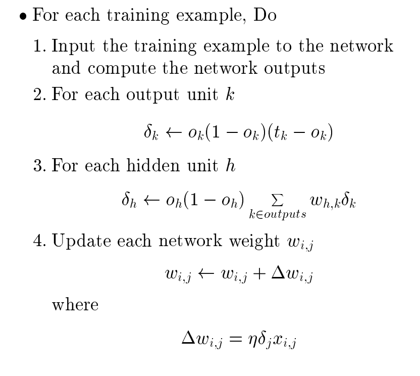
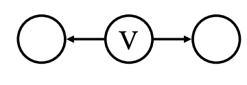
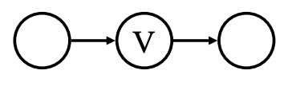
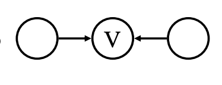
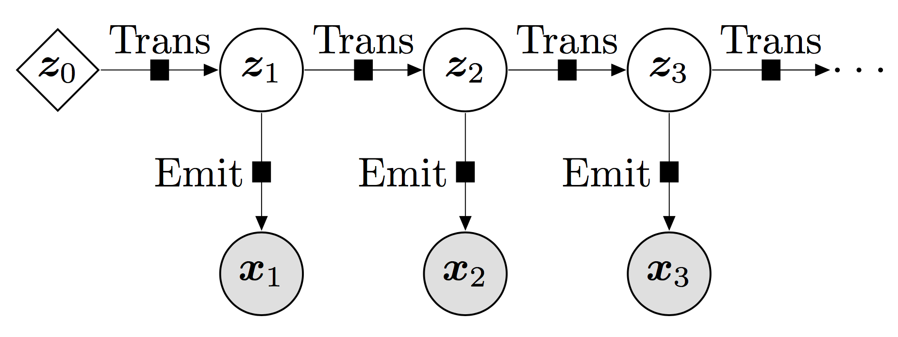
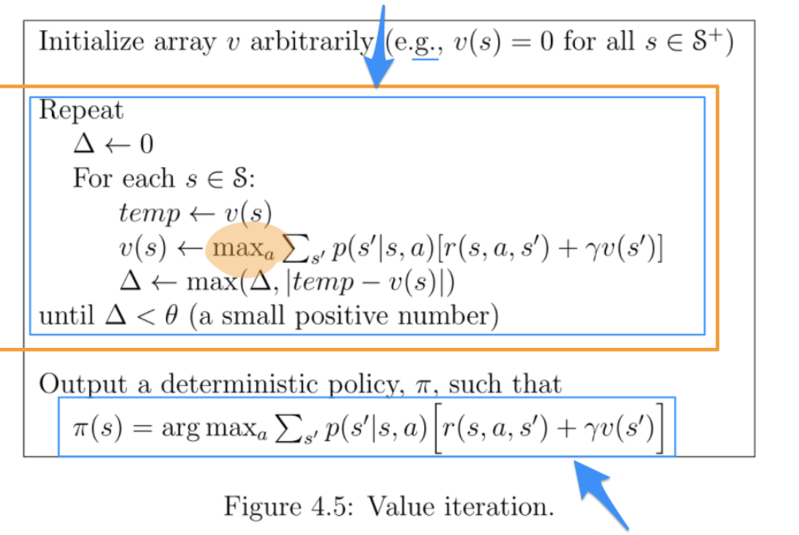

# Deep Neural Networks
## Neural Networks
In general, neural networks have lots of node and each node will perform a transformation. In the easiest way, a linear transmission could be viewed as  $\sum w _ i x _ i$. It is the hard bias for this neural network, it is how each neuron could do. Neural Networks are also built as a layered Feedforward network, and the hard bias is the topology and activation function, they represent the expressive power for the network. The soft bias is the weight in the neuron.

The transformation function is called activation function. When we use liner unit, it represent all linear function. And we could use MSE( $w* = argmin _ w \sum (f _ w(x _ i)-y _ i)^2$) to optimize the network. If we want to represent binary function or linear separator, we could use perceptron function( $\sigma(net) = 1 (wx>0) -1 (wx<=0)$) and it could perform AND and OR easily. We could use two layer of AND OR to perform any bool functions, but this function could not be differentiated, therefore in the most case, we use sigmoid function( $\sigma(net) = \frac{1}{1+e^{-net}}$) as activation function. 

   
## Optimization methods

We use gradient descent to optimize the neuron networks. We first use linear unit as an example, it is represented as following:

$$o=w _ {0}+w _ {1}x _ {1}+\cdots+w _ {n}x _ {n}$$

Then we could get loss function: $E[\vec{w}]=frac{1}{2}\sum _ {d \in D} (t _ {d}-o _ {d})^{2}$, then we could get the gradient, which is $\nabla E [\vec{w} ]$, we need to use $w _ i$ to partial derivative the E. Next we could get the difference for each w. $\Delta w _ {i}=-\eta \frac{\partial E}{\partial w _ {I}}$. In linear unit, we could get $\frac{\partial E}{\partial w _ {i}}=\sum _ {d}(t _ {d}-o _ {d})(-x _ {i,d})$. 

The general steps for gradient descent is:

1. In Initialize each $w _ {I}$ to some small random value.
2. Until the termination condition is met, Do
- Initialize each $\Delta w _ i$ to zero.
- For each (x,t) in training _ examples, Do
	- Input the instance x to the unit and
compute the output o
	- For each linear unit weight $w _ i$, Do $\Delta w _ {i}=\Delta w _ {i}+\eta(t-o)x _ {i}$
3. For each linear unit weight $w _ i$, Do $w _ {i}= w _ {i}+\Delta w _ {i}$

For stochastic gradient decent, it will update the weight based on every training data. A compromise between computing the true gradient and the gradient at a single example is to compute the gradient against more than one training example (called a "mini-batch") at each step. The advantages for sgd is it doesn't require storing all training data in memory and it allows adding new data in an "online" setting. Stochastic gradient descent does not have faster convergence rate compared to the gradient descent.

For back propagation, it is a multi-layer gradient descent. For the output layer, it uses normal function to calculate the gradient, then in each hidden layer, it will use next layer's result to calculate the difference. In sigmoid network, we could use the following procedures. It will update all weights after getting all weight difference.

## Representation learning

The goal of representation learning or feature learning is to find an appropriate representation of data in order to perform a machine learning task.

In particular, deep learning exploits this concept by its very nature. In a neural network, each hidden layer maps its input data to an inner representation that tends to capture a higher level of abstraction. These learnt features are increasingly more informative through layers towards the machine learning task that we intend to perform (e.g. classification).

In Classical prediction pipeline, we use Hand-engineer features and they need prior knowledge. In Deep learning pipeline, we could learn the features and the classifier jointly, also discover interactions and nonlinear
relationships. We could map data to space where data is separable.

## Convolution Neural Networks

It is powerful feature extractor (hard bias) to learn features in images but it needs lots of training data. It uses convolution kernels to learn features, using subsampling(pooling max filter) to reduce intermediated result.

## Recurrent Neural Networks

RNNs can use their internal state (memory) to process sequences of inputs. The idea behind RNNs is to make use of sequential information. In a traditional neural network we assume that all inputs (and outputs) are independent of each other. But for many tasks that’s a very bad idea. If you want to predict the next word in a sentence you better know which words came before it. RNNs are called recurrent because they perform the same task for every element of a sequence, with the output being depended on the previous computations. 

The Vanishing / exploding gradients could be solved by Long Short-Term Memory. 

## AutoEncoders 

An autoencoder neural network is an unsupervised learning algorithm that applies backpropagation, setting the target values to be equal to the inputs.

The autoencoder tries to learn a function $h _ {W,b}(x) \approx x$. In other words, it is trying to learn an approximation to the identity function, so as to output $\hat x$ that is similar to x. The identity function seems a particularly trivial function to be trying to learn; but by placing constraints on the network, such as by limiting the number of hidden units, we can discover interesting structure about the data.

1. Map the input to a compact representation z
2. Use the representation z to reconstruct the input
3. Can learn encoder & decoder mappings without any labels
4. Learned z picks up the most important factors of variation

## GANs

Discriminative algorithms try to classify input data; that is, given the features of a data instance, they predict a label or category to which that data belongs. Generative algorithms do the opposite. Instead of predicting a label given certain features, they attempt to predict features given a certain label.

One neural network, called the generator, generates new data instances, while the other, the discriminator, evaluates them for authenticity; i.e. the discriminator decides whether each instance of data it reviews belongs to the actual training dataset or not.

Variational autoencoders are generative algorithm that add an additional constraint to encoding the input data, namely that the hidden representations are normalized. Variational autoencoders are capable of both compressing data like an autoencoder and synthesizing data like a GAN. However, while GANs generate data in fine, granular detail, images generated by VAEs tend to be more blurred. 

# Bayesian Models

Prior is an important concept in Bayes' thinking. It captures the belief for the right answer before seeing the data. In uniform distribution, prior is $\pi(h) = 1/|H|$ if h in H.

The posterior is the probability of reason after seeing the data. It is $p(h|D)$. 

Likelihood is another important concept. It will tell you under the given the parameters, what is the probability for data, expressing as $L(D|h)$. 

We could express bayes rule as $p(h|D)=(\Pi(h)L(D|h)/P(D)$ = prior * likelihood/evidence. Here evidence is $\sum _ {h'}\Pi(h')L(D|h')$.

For prior odds, it is equal to  $\frac{\pi(h)}{1-\pi(h)}$, the likelihood ratio is equal to $\frac{L(D|h)}{L(D|!h)}$

## MAP and MLE

From the Bayes rule, we know $$P(\theta|X)=\frac{P(X|\theta)P(\theta)}{P(X)}$$. Because $P(X)$ is the same, we could omit this value. $P(\theta|X) \propto P(X|\theta)P(\theta)$ If we want to find the most likely $\theta$, we need to have $\theta _ {MAP}=\underset{\theta}{\arg\max}P(X|\theta)P(\theta)$. If data point is independent, we can use $\underset{\theta}{\arg\max}\log\prod _ {i}P(x _ {i}|\theta)P(\theta)$ to calculate the result. To make it easier to calculate, we use log in most cases. It is called as Maximum A Posteriori.

For Maximum Likelihood Estimation, we want to maximize the likelihood function, which is $P(X|\theta)$. We want to know which theta could result in the given data.

$$\begin{aligned}\theta _ {MLE} &= \underset{\theta}{\arg\max}P(X|\theta)\\&=\underset{\theta}{\arg\max}\prod _ {i}P\left(x _ {i}|\theta\right)\end{aligned}$$

The difference between MLE and MAP is $P(\theta)$, if all possible reasons we need to consider is the same, MLE is equal to MAP.

## Naive Bayes

Naive Bayes is the extension for MAP algorithm. We could use $$j _ {NB} = argmax _ j p(cat=j)\prod p(a _ i|j)$$ to calculate the most possible labels for the given data.

In the text field, we could assume the probability for given label is based on the frequency of labels in the whole dataset. Then using the frequency of $a _ i$ in the given label to calculate $P(a _ i|j)$

Sometimes, if there is no data under some labels in the training data, we need to use Laplace smoothing, adding 1 to both fraction side. $$P(w|c)=\frac{\operatorname{count}(w,c)+1}{\operatorname{count}(c)+|V|}$$

## DAG

A Bayesian network is a probabilistic graphical model that represents a set of variables and their conditional dependencies via a directed acyclic graph (DAG).

The main problem it want to solve is to learn join distribution over some variable set. If there is p binary variables, we will need $2^p - 1$ free parameters to represent the whole possibilities. It is very hard for computation. If we could know $x _ i$ and $x _ j$ conditional independent on any subsets, we only need O(p) parameters.

That's why we need a graph to represent the relationship between variables. It can reduce the free parameters. If we want to calculate P(A|B,C) without any independence information, we need |A| * |B| * |C| to represent it. If B is independent with A, it is P(A|B).

The key idea in Bayesian network.

- nodes : propositional variables
- edges : local dependences 
- connected: dependent
- not connected: may dependent

We could use the graph to discover new dependency. The probability of joint distribution in the graph is $p(x _ 1,..x _ p) = \prod p(x _ i|parents(x _ i)$. We also know $X _ i$ is independent with all non-descendants if given the parents of $x _ i$.

DGM is a language for expressing condition - hard bias, but it is not a completed language, it could not represent all bias.

## Conditional/Marginal Independence

Conditional independence is x and y are independent with each other if we know some variables. Random variable X is conditionally independent of random variable Y given random variable Z if $P(X|Y,Z) = P(X|Z)$. The knowledge of Y doesn't affect your belief in the value of X, given a value of Z.

Marginal Independence is when your knowledge of Y’s value doesn’t affect your belief in the value of X. If $P(X=x _ {i}|Y=y _ {k})=P(X=x _ {i})$.

D-speration is one way to decide the dependency between variables. 

 In this scenario, if E is evidence, we could know this path is blocked..

 

If E is evidence, we could know this path is blocked.

 If E is not evidence and neither are any of its descendants. It is blocked.

Another way to solve the problem is to use the following steps:

1. Draw the ancestral graph. Construct the “ancestral graph” of all variables mentioned in the probability expression. This is a reduced version of the original net, consisting only of the variables mentioned and all of their ancestors
2. “Moralize” the ancestral graph by “marrying” the parents. For each pair of variables with a common child, draw an undirected edge
3. "Disorient" the graph by replacing the directed edges (arrows) with undirected edges (lines).
4. Delete the givens and their edges. If the independence question had any given variables, erase those variables from the graph and erase all of their connections, too
5. If the variables are disconnected in this graph, they are guaranteed to be independent.

## Hidden Markov Models 

In Markov random field, it is an undirected graphical model, which is a set of random variables having a Markov property described by an undirected graph. There may be a cyclic dependencies. The Markov blanket for a node is simply its adjacent nodes.

1. $x _ i$ is independent with others given $MB(x _ i)$
2. any subset is independent with any other subsets given any separating subset.
3. $x _ i$ is independent $x _ j$ given everybody else if $x _ i$ and $x _ j$ is not neighbor.

In Markov Models, it is assumed that future states depend only on the current state, not on the events that occurred before it. We could use a matrix to represent the probability from one state to another state.

In hidden Markov Models, there are some hidden variables that are not observed. Each node conditional depends on its parents.

$$p(x _ 1,...x _ n) = p(z _ 1)p(x _ 1|z _ 1)\prod _ {x=2} P(Z _ t|Z _ {t-1})P(X _ t|Z _ t)$$

# Reinforcement Learning

Reinforcement learning is concerned with how software agents ought to take actions in an environment so as to maximize some notion of cumulative reward.

## MDP
In a Markov decision processes, it has following parameters.

- States S
- Actions A
- Transitions T(s,a,s') aka. P(s'|s,a)
- Rewards R(s,a,s') and discount factor $\gamma$
- Start state $s _ 0$

## Bellman backup 

Bellman function is $V^{ * }(s)=\max _ {a}Q^{ * }(s,a)$,$$Q^{ * }(a,s)=\sum _ {s^{\prime}\in\mathcal{S}}\mathcal{P}r(s^{\prime}|s,a)[\mathcal{R}(s,a,s^{\prime})+\gamma V^{*}(s^{\prime})]$$, Q(a,s) is the reward that agent starts from state s0 and execute action a. $V(s)$ is state value. Q is the expectation of reward after choosing a.

It will choose the max Q to update the V. It is expected discounted future reward.

## value iteration

In value iteration, it will update V based on max value of Q.

## policy iteration

There are several steps in policy iteration.

1. Start with some policy $\pi _ 0(s _ i)$
2. Compute the values of the all states according to current policy. Policy is not changed here. V is just $\sum _ {s^{\prime}}p(s^{\prime}|s,\pi(s))[r(s,\pi(s),s^{\prime})+\gamma v(s^{\prime})]$
3. Update policy: $\pi _ {1}(s _ {i})=\operatorname{argmax} _ {a}{r _ {i}+\gamma\sum _ {j}p _ {ij}^{a}V^{\pi _ {0}}(s _ {j})}$
4. Stop when $\pi _ {k+1}=\pi _ {k}$

## SARSA

It means State–action–reward–state–action. The main function for updating the Q-value depends on the current state of the agent "S1", the action the agent chooses "A1", the reward "R" the agent gets for choosing this action, the state "S2" that the agent enters after taking that action, and finally the next action "A2" the agent choose in its new state. The acronym for the quintuple ($s _ t$, $a _ t$, $r _ t$, $s _ {t+1}$, $a _ {t+1}$) is SARSA. In SARSA, you update estimates based on and take the same action.

$$Q(s _ {t},a _ {t})= Q(s _ {t},a _ {t})+\alpha[r _ {t}+\gamma Q(s _ {t+1},a _ {t+1})-Q(s _ {t},a _ {t})]$$

A SARSA agent interacts with the environment and updates the policy based on actions taken, hence this is known as an **on-policy** learning algorithm. SARSA will approach convergence allowing for possible penalties from exploratory moves, whilst Q-learning will ignore them. 

## Q-learning

In Q learning, it will update Q with max action it could take. Q-learning directly learns the optimal policy, whilst SARSA learns a near-optimal policy whilst exploring. Q-learning (and off-policy learning in general) has higher per-sample variance than SARSA, and may suffer from problems converging as a result. In Q learning, you update the estimate from the maximum estimate of possible next actions, regardless of which action you took.
$$Q(s _ t,a _ t)←Q(s _ t,a _ t)+α[r _ {t+1}+γ\max _ {a'}Q(s _ {t+1},a')−Q(s _ t,a _ t)]$$

# EM Algorithm
## Gaussian Mixture Models

If there are many gaussian models mixing with each other, we could get sampled data from this model. How could we estimate the $\mu _ i$ for these value?

Follow the MLE idea, we could get likelihood function with $\prod _ {i} e^{-\frac{(x _ {i}-\mu _ {j})^{2}}{2\sigma^{2}}}$ with $\mu _ j$. If we consider the prior $\lambda _ j$ for model j. The most possible for $\mu$ is 
$$\boldsymbol{\mu} _ {ML}=\arg\max _ {\mu _ {1},\mu _ {2}}\prod _ {i}\sum _ {j}\lambda _ {j}e^{-\frac{(x _ {i}-\mu _ {j})^{2}}{2\sigma^{2}}}$$. But there is no analytical solution for this function, EM algorithm could give a local maximum, not necessary to be global maximum.

If we could get a table Z, when $x _ i$ from Gaussian j,$Z _ {i,j}=1$,otherwise 0. The $\hat \mu _ j = \sum _ i Z _ {i,j}X _ i / \sum Z _ {i,j}$. If we don't know it, we could estimate it with $\hat \mu _ j = \sum E[Z _ {i,j}|\bar \mu] X _ i / \sum E[Z _ {i,j}|\bar \mu]$.

The basic idea for EM is: 

1. Assume the $\mu _ j$ in the model
2. Classify data point to each model
3. Re-estimate the $\mu _ j$
4. Repeat

In GMM:

1. E steps: $$E \left[z _ {i,j}|\mu^{[k]}\right]=\frac{\lambda _ {j}L\left(x _ {i}|\mu=\mu _ {j}^{[k]}\right)}{\sum _ {j^{\prime}}\lambda _ {j^{\prime}}L\left(x _ {i}|\mu=\mu _ {j^{\prime}}^{[k]}\right)}$$
	 In this step, it could classify data point to each cluster.
2. M step: $$\mu _ {j}^{[k+1]}=\frac{\sum _ {i}E\left[z _ {i,j}|\mu^{[k]}\right]\cdot x _ {i}}{\sum _ {i}E\left[z _ {i,j}|\mu^{[k]}\right]}$$ In this step, it could re-estimate the $\mu _ j$

if L is bounded, then it can coverage to a (not nesseary global) local minimum.

## latent variables 

Latent variables, as opposed to observable variables, are variables that are **not directly observed** but are rather inferred from other variables that are observed (directly measured).

# Non-parametric Models
## K-nearest Neighbors

In edger learning, it will choose a hypothesis space H and it is the hard bias. Then given the training data, it can find a member of H, h, that best fits in it.(soft bias). Then h could be apply to any data.

The lazy learning is doing nothing in training step, just saving all data. In test step, it will do prediction based on data in this step.

For K-nearest Neighbors, it finds K nearest neighbors in the training data. Then average the label or find the most labels to predict this data's label. If K=1, it always finds itself. There is no hard bias for KNN, the soft bias is nearby point should have the same label. 

The problem for KNN is: it is possible that different dimension will have different meaning, it is not wise just treat them as same. We could use $w _ i$ to deal with different dimension problem.$f(q) = \frac{\sum K(dist(x _ i,q))y _ i}{\sum K(dist(x _ i,q))}$

Kernel function is any positive semidefinite function of any two inputs. We could use kernel to estimate small dataset and aggregate them to estimate whole dataset. We can also use kernel smoothing. 

For kernel function:  K(x,y) = K(y,x) and it is always positive.

## Support Vector Machines

SVM wants to classify data using a boundary. Take 2d graph as example, there are + and - in it. We can see if for all x+, wx+b>=1, for all x-, wx+b<=-1. Think about value $y _ i$, it could combine two function, if x+,$y _ i=1$,else $y _ i=-1$. Then the result is $y _ i (w^T x+b)>=1$. For equal situation, it is boundary. $y _ i (w^T x + b)-1=0$.

To make the boundary width bigger, we need to max $\frac{(x+ - x- )w}{||w|| _ {2}}$, equally  min $1/2 ||w||^2 _ 2$  sub y _ i(x^T x _ i + b)>=1. Hard margin is to make sure separate data, soft margin introduce the hinge loss, useful when data is not linearly separable. $\max\left(0,1-y _ {i}\left(\vec{w}\cdot\vec{x} _ {i}-b\right)\right)$

By solving for the Lagrangian dual of the problem, we could get $x _ i x _ i$ in the function, here we could apply different kernel function to get different boundary.

